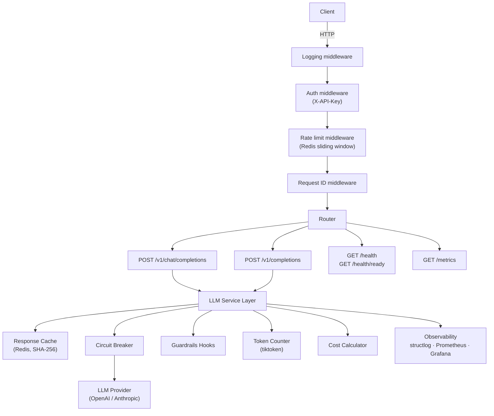

# deployer — Production-Ready LLM Application Template

A cloneable FastAPI template that handles the operational concerns of LLM applications so you can focus on your LLM logic.

---

## Problem

Most AI projects die in notebooks. Teams that do get to production spend weeks solving the same problems: rate limiting, cost tracking, structured logging, health checks, secret management. This template provides an opinionated starting point that handles production concerns from day one.

This is not a generic FastAPI boilerplate. Every component exists because LLM workloads are different from traditional APIs — token-based billing, high latency variance, streaming responses, and cost that scales with usage rather than compute.

---

## Architecture



---

## Quickstart

```bash
git clone https://github.com/your-org/deployer.git
cd deployer
cp .env.example .env          # edit OPENAI_API_KEY and API_KEYS
docker compose up
```

Test the API:
```bash
curl -X POST http://localhost:8000/v1/chat/completions \
  -H "X-API-Key: your-key" \
  -H "Content-Type: application/json" \
  -d '{
    "model": "gpt-4o-mini",
    "messages": [{"role": "user", "content": "Hello!"}]
  }'
```

Streaming:
```bash
curl --no-buffer -X POST http://localhost:8000/v1/chat/completions \
  -H "X-API-Key: your-key" \
  -H "Content-Type: application/json" \
  -d '{"model": "gpt-4o-mini", "messages": [{"role": "user", "content": "Count to 5"}], "stream": true}'
```

---

## Configuration

All configuration is via environment variables. Copy `.env.example` to `.env` to get started.

| Variable | Default | Description |
|----------|---------|-------------|
| `API_KEYS` | *(required)* | Comma-separated API keys: `key1,key2` |
| `REQUIRE_AUTH` | `true` | Set `false` to disable auth (dev only) |
| `LLM_PROVIDER` | `openai` | `openai` or `anthropic` |
| `OPENAI_API_KEY` | — | OpenAI API key |
| `ANTHROPIC_API_KEY` | — | Anthropic API key |
| `DEFAULT_MODEL` | `gpt-4o-mini` | Default model for requests |
| `RATE_LIMIT_REQUESTS` | `60` | Max requests per window per API key |
| `RATE_LIMIT_WINDOW_SECONDS` | `60` | Rate limit window in seconds |
| `CACHE_ENABLED` | `true` | Enable Redis response cache |
| `CACHE_TTL_SECONDS` | `3600` | Cache TTL in seconds |
| `CIRCUIT_BREAKER_THRESHOLD` | `5` | Failures before opening circuit |
| `CIRCUIT_BREAKER_RECOVERY_SECONDS` | `30` | Seconds before half-open probe |
| `REDIS_URL` | `redis://localhost:6379/0` | Redis connection URL |
| `LOG_LEVEL` | `INFO` | Log level: DEBUG, INFO, WARNING, ERROR |
| `WORKERS` | `1` | Uvicorn worker processes |
| `CORS_ORIGINS` | `*` | Comma-separated CORS origins |

---

## API Reference

### POST /v1/chat/completions

OpenAI-compatible chat completion. Any OpenAI SDK client works out of the box.

```bash
curl -X POST http://localhost:8000/v1/chat/completions \
  -H "X-API-Key: your-key" \
  -H "Content-Type: application/json" \
  -d '{
    "model": "gpt-4o-mini",
    "messages": [
      {"role": "system", "content": "You are a helpful assistant."},
      {"role": "user", "content": "What is a circuit breaker?"}
    ],
    "temperature": 0.7,
    "max_tokens": 200
  }'
```

Add `"stream": true` for Server-Sent Events streaming.

### POST /v1/completions

Simple prompt-in, text-out:

```bash
curl -X POST http://localhost:8000/v1/completions \
  -H "X-API-Key: your-key" \
  -H "Content-Type: application/json" \
  -d '{"model": "gpt-4o-mini", "prompt": "The capital of France is"}'
```

### GET /health

Deep health check — returns Redis connectivity, LLM provider reachability, and uptime.

### GET /health/ready

Kubernetes-style readiness probe. Returns `200` if ready, `503` if not.

### GET /metrics

Prometheus exposition format. Scrape this with your Prometheus instance.

---

## LLM-Specific Features

What makes this different from a generic FastAPI template:

- **Token counting** — Every request logs input/output tokens and estimated cost. Powered by tiktoken (pre-request) and provider response (post-request actual).
- **Cost tracking** — Aggregates spending per API key and model. Prevents bill shock.
- **Response caching** — Identical prompts never hit the LLM twice. SHA-256 hash of (model + messages + temperature) as the cache key. Configurable TTL.
- **Circuit breaker** — LLM providers have outages. After 5 consecutive failures the breaker opens and fails fast instead of hanging. Recovers automatically after the configured window.
- **Guardrails hooks** — Extensible pre/post processing injection points for PII detection, input validation, output filtering. Implement `PreHook` and `PostHook` interfaces.
- **OpenAI-compatible API** — Drop-in replacement for any OpenAI SDK client. Point your `base_url` at this service.
- **Rate limiting** — Redis sliding window per API key. Default 60 req/min, configurable.

---

## Observability

After `docker compose up`:

| Service | URL | Credentials |
|---------|-----|-------------|
| API | http://localhost:8000 | `X-API-Key: your-key` |
| Grafana | http://localhost:3000 | admin / admin |
| Prometheus | http://localhost:9090 | — |

The Grafana dashboard is pre-loaded with panels for:

- Token throughput (tokens/sec by model and direction)
- Cost rate (USD/sec by model)
- Request latency p50/p95/p99
- Streaming time-to-first-token p50/p95
- Cache hit rate by model
- Circuit breaker state by provider
- Rate-limit rejections by API key
- Provider errors by type

LLM-specific Prometheus metrics:

| Metric | Type | Purpose |
|--------|------|---------|
| `llm_tokens_total` | Counter | Tokens by model, direction, api_key |
| `llm_request_cost_usd` | Histogram | Cost distribution per request |
| `llm_cost_total_usd` | Counter | Cumulative spend |
| `llm_request_duration_seconds` | Histogram | End-to-end latency |
| `llm_time_to_first_token_seconds` | Histogram | Streaming TTFT |
| `llm_cache_hits_total` | Counter | Cache hit count by model |
| `llm_cache_misses_total` | Counter | Cache miss count by model |
| `llm_circuit_breaker_state` | Gauge | 0=closed, 1=open, 2=half-open |
| `llm_rate_limit_rejected_total` | Counter | Rejected requests by api_key |
| `llm_provider_errors_total` | Counter | Provider errors by type |

---

## Technical Decisions

| Decision | Options Considered | Choice | Rationale |
|----------|--------------------|--------|-----------|
| API spec | Custom, OpenAI-compatible, LiteLLM | OpenAI-compatible | Any OpenAI SDK client works without modification |
| LLM client | LangChain, LiteLLM, direct httpx | Direct httpx | No framework lock-in, full control over streaming and retries |
| Rate limiting | In-memory, Redis, API gateway | Redis sliding window | Distributed-ready, survives restarts, per-key granularity |
| Caching | None, exact match, semantic | Exact match (prompt hash) | Deterministic, simple, effective |
| Circuit breaker | tenacity, custom | Custom (~50 lines) | No dependency for a simple state machine |
| Logging | stdlib logging, loguru, structlog | structlog | JSON output, context binding, production standard |
| Token counting | Estimate, tiktoken, provider | tiktoken (pre) + provider (post) | Pre-request for rate limiting, post-response for billing |
| Reverse proxy | Nginx, Traefik, none | None (in template) | Less complexity; Nginx/Traefik documented as optional production layer |
| Package manager | pip, poetry, uv | uv | Fast, lockfile support, replaces pip + pip-tools |

---

## Project Structure

```
deployer/
├── src/deployer/
│   ├── main.py                     # FastAPI app factory, lifespan
│   ├── config.py                   # Pydantic Settings — all env vars
│   ├── dependencies.py             # FastAPI dependency injection
│   ├── middleware/
│   │   ├── auth.py                 # X-API-Key validation
│   │   ├── rate_limit.py           # Sliding window rate limiter
│   │   ├── request_id.py           # X-Request-ID propagation
│   │   └── logging.py             # Structured request logging
│   ├── api/v1/
│   │   ├── chat.py                 # POST /v1/chat/completions
│   │   ├── completions.py          # POST /v1/completions
│   │   ├── health.py               # GET /health, /health/ready
│   │   └── metrics.py              # GET /metrics
│   ├── llm/
│   │   ├── providers/              # OpenAI + Anthropic implementations
│   │   ├── token_counter.py        # tiktoken-based counting
│   │   ├── cost_calculator.py      # Model-aware pricing
│   │   ├── cache.py                # Redis response cache
│   │   ├── circuit_breaker.py      # Circuit breaker state machine
│   │   └── guardrails.py           # Pre/post processing hooks
│   └── observability/
│       ├── metrics.py              # Prometheus metric definitions
│       └── logger.py               # structlog configuration
├── tests/
│   ├── unit/                       # fakeredis, pure logic
│   └── integration/                # httpx AsyncClient, mock provider
├── infra/
│   ├── prometheus/                 # Scrape config
│   └── grafana/                    # Auto-provisioned datasource + dashboard
├── Dockerfile                      # Multi-stage: builder + runtime
├── docker-compose.yml              # app + Redis + Prometheus + Grafana
├── docker-compose.prod.yml         # Production overrides
└── .pre-commit-config.yaml         # ruff + mypy + detect-secrets
```

---

## Testing

```bash
# All tests
make test

# Unit tests only
make test-unit

# Integration tests only
make test-integration

# With coverage report
uv run pytest tests/ --cov=src/deployer --cov-report=html
```

Coverage target: 80%+ on `llm/` and `middleware/`. Tests use fakeredis for Redis-dependent code and an in-process mock LLM provider — no real provider calls in CI.

---

## Production Considerations

This template is a starting point. For real production you will want to add:

- **Reverse proxy** — Nginx or Traefik in front for TLS termination, connection pooling, and static file serving
- **Secret management** — Replace env vars with HashiCorp Vault, AWS Secrets Manager, or Docker secrets. Never commit secrets.
- **Kubernetes** — The Docker Compose setup is dev/staging. For K8s: convert to Helm chart, add HPA for the app, use managed Redis (ElastiCache, Upstash)
- **Database** — If you need persistent cost aggregation beyond Prometheus, add PostgreSQL and a background job to flush metrics
- **Multiple workers** — Set `WORKERS` env var to `2*CPU+1` in production. Uvicorn with multiple workers handles concurrent requests efficiently
- **Structured log ingestion** — Ship JSON logs to Loki, Datadog, or CloudWatch for search and alerting
- **PII detection** — The guardrails hooks are extensible placeholders. Implement real PII detection (Presidio, AWS Comprehend) in `PreHook`

---

## License

MIT
